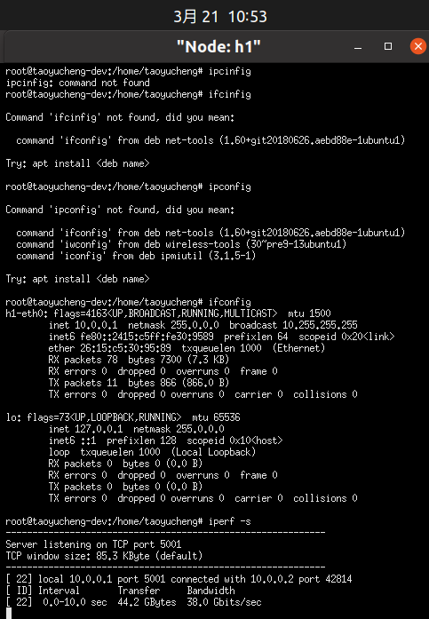
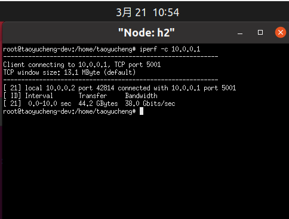
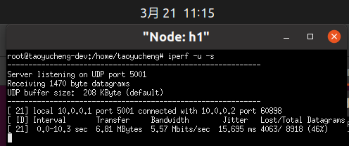
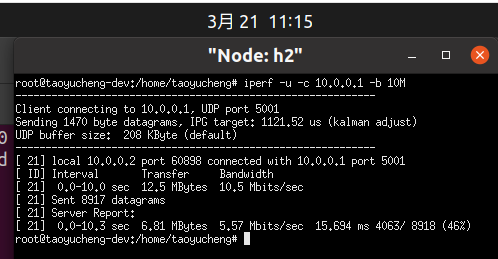
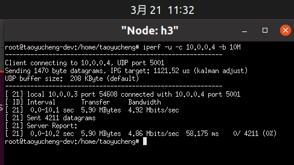
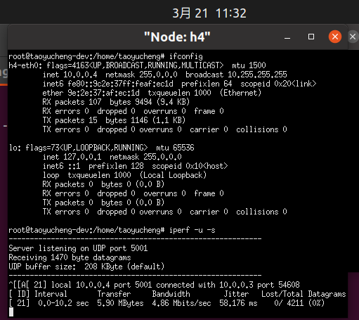
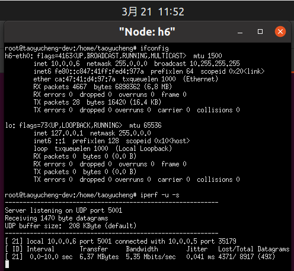
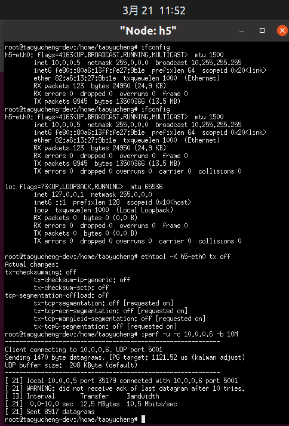
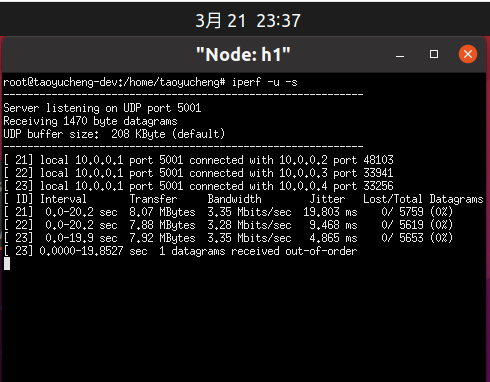
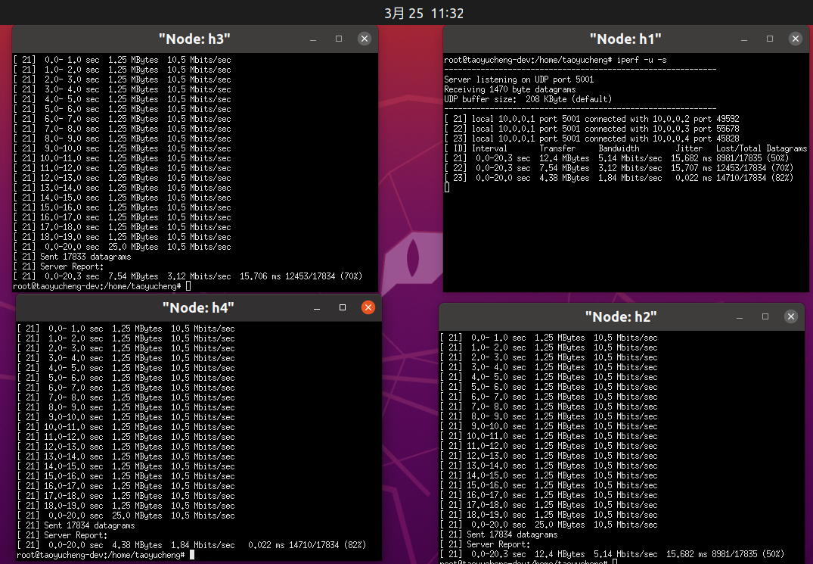

# Lab3-Report

*本文档是对lab3所有task和question的总结，所有截图分别位于对应task的文件夹下。*

**Task 1 请在你自己的环境中完成上面的连通性测试，并以截图的形式分别记录Node:h1和Node:h2中 iperf的输出结果。要求：截图尽可能清晰，且需要连同任务栏的系统时间⼀起截图，后续的所有截图都要求包含系统时间。**

Node:h1中 iperf的输出结果：



Node:h2中 iperf的输出结果：




**Task 2.1 网卡限速**

Node:h1中 iperf的输出结果：



Node:h2中 iperf的输出结果：




**Task 2.2 队列限速**

Node:h3中 iperf的输出结果：



Node:h4中 iperf的输出结果：




**Task 2.3 Meter表限速** 

Node:h6中 iperf的输出结果：



Node:h5中 iperf的输出结果：




**Question 1 尝试理解Line19,20两条指令，指出每条指令的具体工作是什么，并逐个分析其中各个参数的具体含义。**

- **line 19：**`ovs-ofctl add-flow s1 in_port=5,action=meter:1,output:6 -O openflow13`

  用于对s1交换机添加下发流量表操作：数据包从5端口发入，经由meter表1处理后，再从6端口转出。其中各参数含义分析如下：

  `add-flow`：是指添加下发流量表操作

  `s1`：是指定的交换机

  `in_port=5`：表示入端口为5

  `action=meter:1,output:6`：指定转发动作，表示从出端口6转发出去之前，会先用meter表1进行处理。根据**line 11**可以看出，处理方式是丢弃掉超过5M的流量，然后再转发到6端口

  `-O openflow13`：指定OpenFlow version为openflow13

- **line 20**：`ovs-ofctl dump-flows s1 -O openflow13`

  用于查看s1交换机的流量表。其中各参数含义分析如下：

  `dump-flows`：是指查看流量表操作

  `s1`：是指定的交换机

  `-O openflow13`：指定OpenFlow version为openflow13


**Question 2 到这里，你已经完成了三种限速方式的实验，并获得了三组测试数据，请你就三组数据中的带宽、抖动和丢包率等参数，对三种限速方式进行横向比较，并适当地分析原因。**

|             | bandwidth(Mbits/sec) | jitter(ms) | lost/total datagrams |
| ----------- | -------------------- | ---------- | -------------------- |
| 网卡限速    | 5.57                 | 15.694     | 46%                  |
| 队列限速    | 4.86                 | 58.176     | 0%                   |
| Meter表限速 | 5.35                 | 0.041      | 49%                  |

- 网卡限速会在接收分组的速率超过配置速率后，直接将超出带宽的数据包丢弃掉，因而会带来很高的丢包率。因而从本次实验的结果来看，其虽然能基本满足限速要求，但抖动较大，丢包率也很高。
- 队列限速设置有缓冲区，把超出带宽的数据包先缓存起来之后再进行处理，可以缓存和调度数据包发送顺序，比policing更加精确和有效。所以从本次实验的结果来看，其不仅对限速要求满足得最好，丢包率也相对最低（几乎不会丢包）。但也因为其会对数据包进行缓存起来平滑网络，以至于其抖动可能会很大。
- Meter表限速是SDN的限速方式，数据包基于其当前的速率会被Meter Band来处理，而超出带宽的包会被直接丢弃。因而从本次实验的结果来看，其虽然能基本满足限速要求，抖动也不大，但丢包率也不低。


**Task3 在限制Server端（h1）的带宽为10Mb的前提下，观察稳定后的三个Client的带宽，将结果截图并简单分析。**

```
#使⽤队列queue将server的带宽限制到10Mb
ovs-vsctl set port s1-eth1 qos=@newqos -- \
--id=@newqos create qos type=linux-htb queues=0=@q0 -- \
--id=@q0 create queue other-config:max-rate=10000000
```

Node:h1中观察得到三个client的输出结果分别为：



可见3个client的带宽大小几乎相同，均为3.3Mb左右。这是因为三个client的结点均未做任何配置和限速，在同样的条件下同时运行，因而三者竞争力几乎相同，平分server的10Mb带宽。


**Task4 你可以通过上述三种限速的方法来达成目标，请记录你的设计过程（思路及运行指令），并将你稳定后的三个Client的带宽结果截图。**

结合前面的实验内容，我决定采用Meter表限速的方式对3个Client的带宽进行限制。

考虑到要求h2在5Mb及以上， h3在3Mb及以上， h4在保证h2和h3的前提下尽量多。因而我决定将h2和h3的带宽分别限制在不超过5.1Mb和3.1Mb，而h4的带宽也就限制在10-5.1-3.1=1.8Mb的大小，以保证h2和h3都能始终包有不低于5Mb和3Mb的带宽。

```
ovs-ofctl del-meters s1 -O OpenFlow13 #删除之前配置的meter表
ovs-ofctl -O OpenFlow13 dump-meters s1 #查看meter表
#配置meter表
ovs-ofctl add-meter s1 meter=1,kbps,band=type=drop,rate=5100 -O OpenFlow13
ovs-ofctl add-meter s1 meter=2,kbps,band=type=drop,rate=3100 -O OpenFlow13
ovs-ofctl add-meter s1 meter=3,kbps,band=type=drop,rate=1800 -O OpenFlow13
ovs-ofctl add-flow s1 in_port=2,action=meter:1,output:1 -O openflow13
ovs-ofctl add-flow s1 in_port=3,action=meter:2,output:1 -O openflow13
ovs-ofctl add-flow s1 in_port=4,action=meter:3,output:1 -O openflow13
ovs-ofctl -O OpenFlow13 dump-meters s1 #查看meter表

ethtool -K h2-eth0 tx off		#在h2中关闭⽹卡的tx校验
ethtool -K h3-eth0 tx off		#在h3中关闭⽹卡的tx校验
ethtool -K h4-eth0 tx off		#在h4中关闭⽹卡的tx校验
```

Node:观察得到的输出结果：



可以看出，我们成功满足了h2在5Mb及以上， h3在3Mb及以上的要求。
